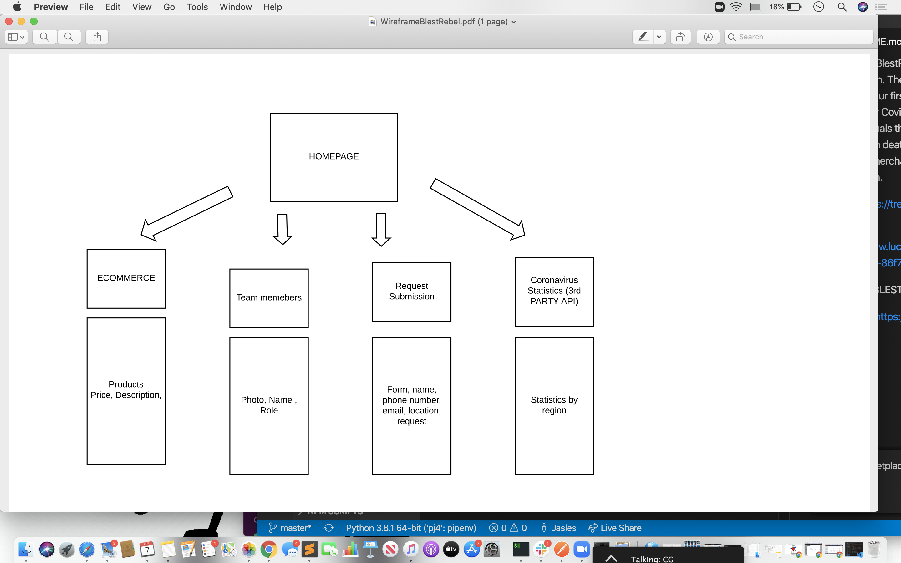
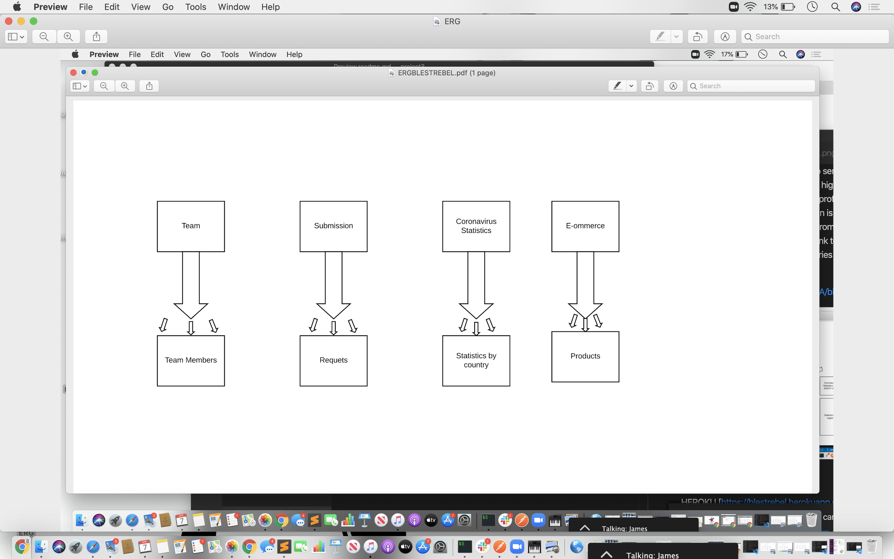

The site is BlestRebel and created to serve the world through art and tech. The app is designed to highlight the light in a bad situation. Our first initiative  as a non profit is to focus on those affected by Covid-19. The application is designed to highlight the individuals that have recovered from the virus instead of focusing on deaths. The app has a link to a retail store that offers art merchandise and accessories to fund the nonprofit orginization. 

Trello
[https://trello.com/b/S4XuX0PA/blestrebel]

HEROKU
[https://blestrebel.herokuapp.com/]

